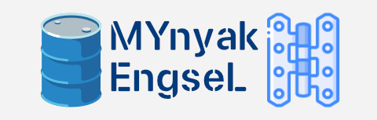

<p align="center">
  
</p>

<h1 align="center">🐍 Engsel (Python Edition) 🐍</h1>

<p align="center">
  <strong>Comprehensive Command-Line Client for Indonesian Mobile Telco Ecosystem</strong>
</p>

<p align="center">
  <a href="https://www.python.org"></a>
  <a href="LICENSE"></a>
  <a href="https://termux.dev"></a>
  <a href="https://github.com/tsaQB"></a>
</p>

<p align="center">
  <a href="#-sekilas-tentang-engsel">Sekilas</a> •
  <a href="#-fitur-utama">Fitur Utama</a> •
  <a href="#-instalasi--penggunaan">Instalasi</a> •
  <a href="#-konfigurasi-env">Konfigurasi</a> •
  <a href="#-struktur-proyek">Struktur Proyek</a> •
  <a href="#-versi-go-ultra-fast">Versi Go</a> •
  <a href="#-disclaimer">Disclaimer</a>
</p>

---

## 📖 Sekilas Tentang Engsel

**Engsel** adalah tool CLI (*Command-Line Interface*) interaktif berbasis Python yang dirancang untuk mempermudah pengecekan kuota, pembelian paket data, transaksi QRIS / E-Wallet, hingga manajemen Akrab/Family Plan dan Circle langsung dari terminal.

Tool ini sangat ramah untuk dijalankan di lingkungan **Termux (Android)** maupun perangkat PC / laptop (Linux, macOS, Windows).

```
┌──────────────────────────────────────────────────────────┐
│  ENGSEL CLI (Python Edition)                             │
│  Designed for Terminal, Termux & Power Users             │
│  Maintained by @tsaQB                                    │
└──────────────────────────────────────────────────────────┘
```

---

## ✨ Fitur Utama

- 📱 **Antarmuka Terminal Interaktif (TUI)**: Navigasi menu yang rapi, informatif, dan responsif dengan dukungan QR Code terminal.
- 🔐 **Autentikasi & Multi-Account**: Manajemen sesi login OTP / CIAM terenkripsi, multi-nomor telepon, dan pembaruan token otomatis.
- 💳 **Metode Pembayaran Fleksibel**:
  - Saldo / Pulsa
  - QRIS (render QR code langsung di layar konsol)
  - E-Wallet (GoPay, OVO, DANA, ShopeePay)
  - Penukaran voucher promo & bounty
- 👨‍👩‍👧‍👦 **Family Plan & Circle**:
  - Kelola kuota anggota paket Akrab
  - Alokasi kuota per anggota
  - Circle sharing & Family Hub
- 🔖 **Bookmark & Katalog Offline**: Simpan paket favorit dan akses daftar promo offline melalui katalog data lokal.

---

## 🚀 Instalasi & Penggunaan

### 1. Di Termux (Android)

Jalankan perintah berikut di aplikasi Termux Anda:

```bash
# 1. Update package dan install git
pkg update -y && pkg install git python -y

# 2. Clone repositori
git clone https://github.com/tsaQB/engsel.git
cd engsel

# 3. Jalankan script setup (otomatis menginstall dependensi yang dibutuhkan)
chmod +x setup.sh
./setup.sh

# 4. Salin dan sesuaikan konfigurasi .env
cp .env.template .env
nano .env

# 5. Jalankan aplikasi
python main.py
```

---

### 2. Di Linux / macOS / Windows PC

```bash
# Clone repositori
git clone https://github.com/tsaQB/engsel.git
cd engsel

# (Opsional) Buat virtual environment
python3 -m venv venv
source venv/bin/activate  # Untuk Windows: venv\Scripts\activate

# Install dependensi
pip install -r requirements.txt

# Siapkan file lingkungan
cp .env.template .env

# Jalankan
python main.py
```

---

## ⚙️ Konfigurasi (`.env`)

Salin berkas `.env.template` menjadi `.env` kemudian lengkapi variabel berikut:

```env
BASE_API_URL=""
BASE_CIAM_URL=""
BASIC_AUTH=""
AX_FP_KEY=""
UA=""
API_KEY=""
ENCRYPTED_FIELD_KEY=""

XDATA_KEY=""
AX_API_SIG_KEY=""
X_API_BASE_SECRET=""
CIRCLE_MSISDN_KEY=""
```

> [!NOTE]
> Seluruh kredensial akun, token sesi login (`refresh-tokens.json`), nomor aktif, dan sidik jari perangkat (`ax.fp`) tersimpan secara lokal dan otomatis dikecualikan oleh [`.gitignore`](.gitignore) demi menjaga kerahasiaan data pengguna.

---

## 📁 Struktur Proyek

```
engsel/
├── app/
│   ├── client/             # Request handler & API integration
│   ├── menus/              # Alur navigasi antarmuka terminal
│   ├── service/            # Business logic (Auth, Sentry, Decoy, Bookmark)
│   ├── type_dict.py        # Definisi struktur data
│   └── util.py             # Fungsi helper & utilitas
├── decoy_data/             # Template data transaksi decoy
├── hot_data/               # Data katalog paket offline
├── .env.template           # Template konfigurasi variabel lingkungan
├── .gitignore              # Proteksi file rahasia dan sampah sistem
├── LICENSE                 # Lisensi open-source MIT
├── main.py                 # File utama untuk menjalankan aplikasi
├── requirements.txt        # Daftar dependensi Python
├── setup.sh                # Skrip instalasi otomatis untuk Termux
└── README.md               # Dokumentasi proyek
```

---

## ⚡ Versi Go (Ultra-Fast & Zero Dependencies)

Mencari versi binary mandiri tanpa perlu install Python, pip, atau compiler?

Kunjungi **[engsel-go](https://github.com/tsaQB/engsel-go)**:
- 🚀 **100% Native Go**
- ⚡ Startup instan (< 40ms) & memori ramah (~12 MB RAM)
- 📦 Single binary tanpa dependensi eksternal

---

## 🛡️ Keamanan & Privasi

- **Penyimpanan Lokal**: Nomor telepon dan token sesi hanya disimpan di perangkat lokal Anda (`refresh-tokens.json`).
- **Bebas Spyware**: Tidak ada pengiriman data kredensial atau analitik ke server pihak ketiga.
- **Git Ignored**: File sensitif telah dikonfigurasi agar tidak pernah ter-commit ke Git.

---

## 📜 Disclaimer

Perangkat lunak ini dibuat hanya untuk tujuan pembelajaran, riset, dan penggunaan pribadi untuk mempermudah manajemen paket seluler melalui terminal. Pengembang tidak bertanggung jawab atas segala bentuk penyalahgunaan, kerugian, atau pelanggaran ketentuan penggunaan oleh pihak penyedia layanan terkait.

---

## 👤 Author

Dikembangkan dan dipelihara oleh:

**Assaqib** ([@tsaQB](https://github.com/tsaQB))  
*Email*: `0xfiqks@gmail.com`  
*GitHub*: [https://github.com/tsaQB](https://github.com/tsaQB)

---

<p align="center">
  Dibuat dengan ❤️ oleh <b>@tsaQB</b>. Jangan lupa berikan Star ⭐ jika proyek ini bermanfaat!
</p>
